# Create connection and load data to Netezza

In this section, we will load Jupyter notebook using IBM Cloud Pak for Data (CP4D) platform. The notebook has steps to connect to Netezza and load data from various sources and use Netezza SQL to query data from the netezza database.

## Steps

1. [Create a new project in CP4D](#1-create-a-new-project-in-cp4d)
1. [Add connection to Netezza server](#2-add-connection-to-netezza-server)
1. [Load notebook to your project](#3-load-notebook-to-your-project)
1. [Install NZPY](#4-install-NZPY)
1. [Configure NPS connection in notebook](#5-configure-NPS-connection-in-notebook)
1. [Loading or Unloading data from external source](#6-loading-or-unloading-data-from-external-source)
1. [Load data from other data sources](#7-load-data-from-other-data-sources)
1. [Load data from object Store](#8-load-data-from-object-store)
1. [Loading and analyzing Australian weather station data](#9-loading-and-analyzing-australian-weather-station-data)

### 1. Create a new project in CP4D

* Log into IBM Cloud Pak for Data and create a new project, by selecting `Projects` from hamburger menu and clicking `New Project +`.

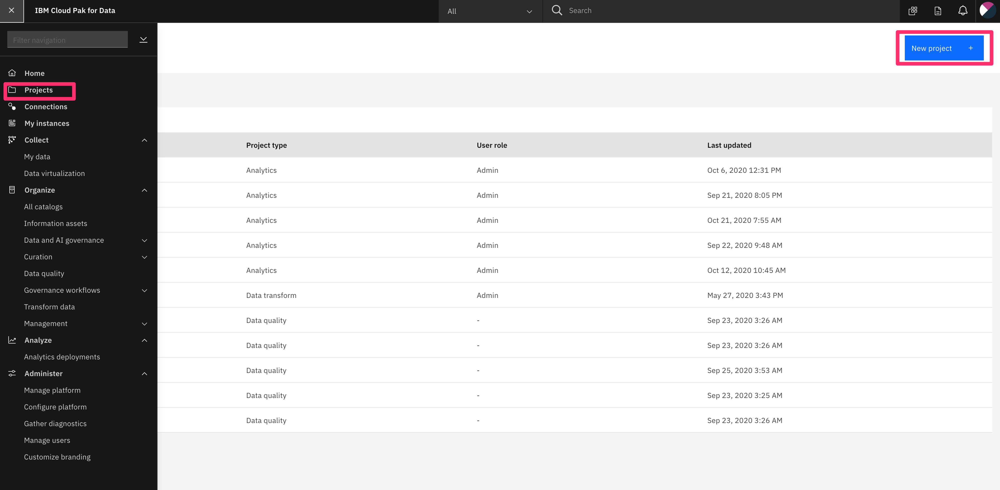

Then, choose `Analytics project`, and select `Create empty project`, provide the project `Name` and click `Create`.

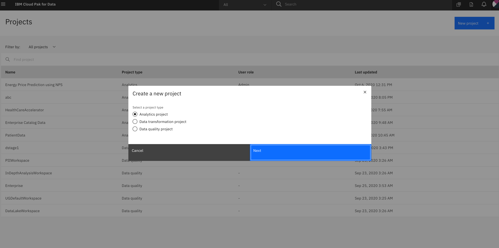

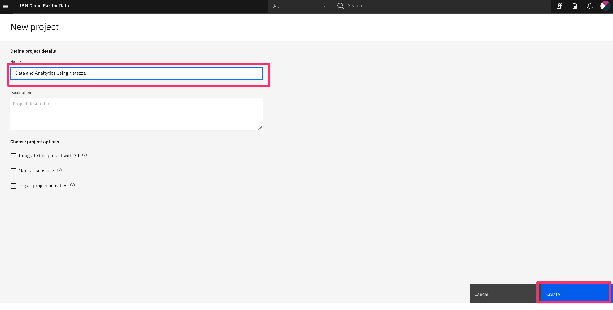

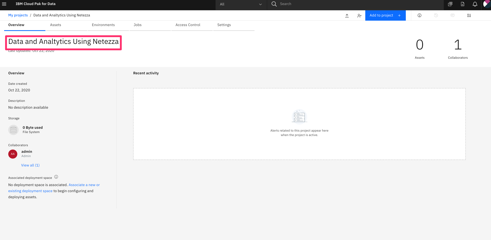


### 2. Add connection to Netezza server

There are two ways you can add connection to the notebook.  Use one of the ways to add connection to NPS.

#### Adding connection using CPD

* From the project page select, `Add to project +`, choose `Connection`

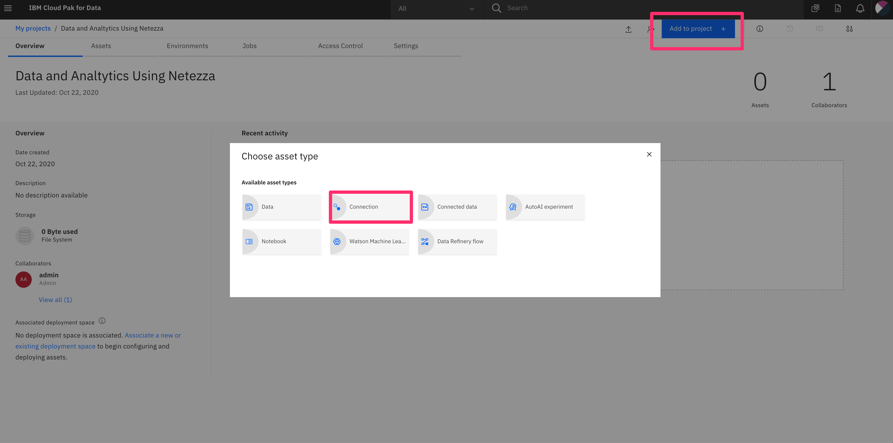

* In the next screen, choose `From Global` tab `NPS for pure analytics`

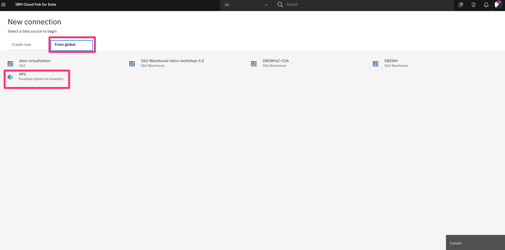

* Fill out the connection details, `Test the connection` and if it is successful, click `Create`.

> NOTE: for database you can use `system` for now. We will be creating our own database and using that in our notebook.

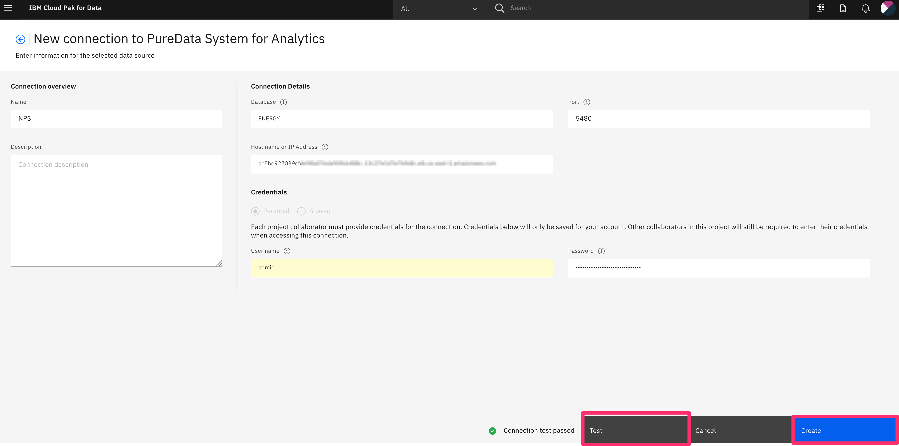

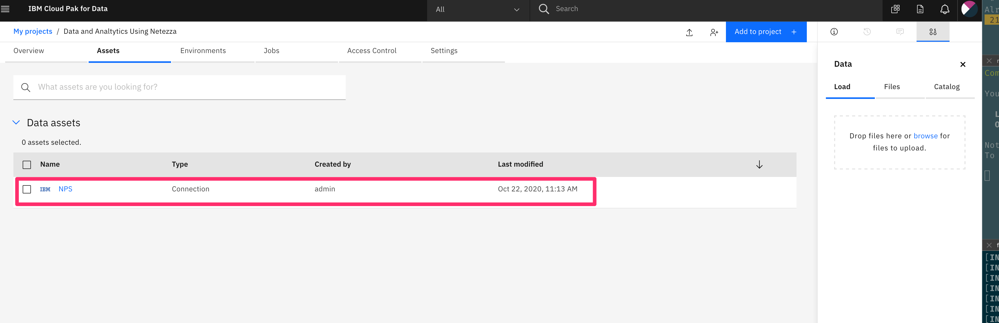

>NOTE: Save the name of the connection for later use.

### 3. Load notebook to your project

* From the project page, click `Add to project +`, and select `notebook` from the options:

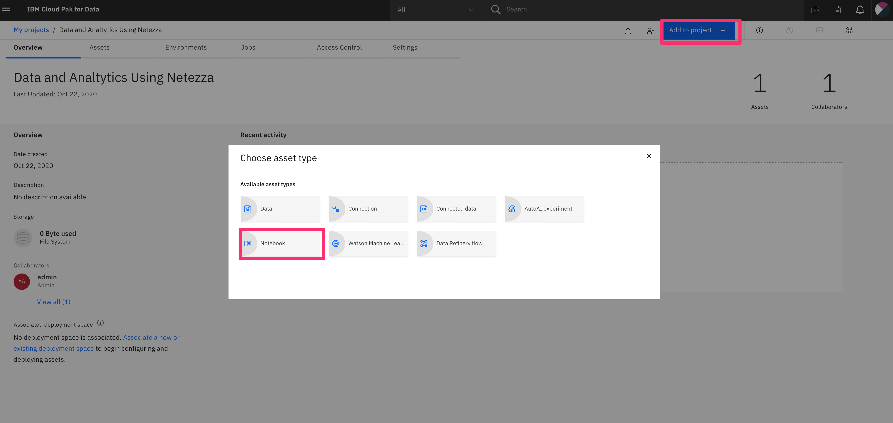

* Select `From URL` tab and fill in the name and provide the `Notebook URL` as below, and click `Create notebook`.

```bash
https://raw.github.com/
```

### 4. Install NZPY

Run the cell that contains `pip install nzpy` which is the only pre-requisite for this notebook. `nzpy` lets us connect to the server and allow us to run DDL and DML SQLs.

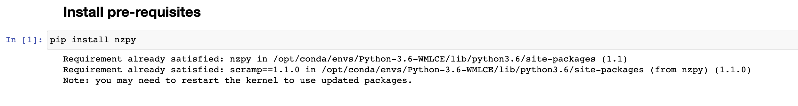


### 5. Configure NPS connection in notebook

* Open the notebook in edit mode, and in the cell with title `Connecting to the database`, provide the name of the connection that you created earlier in step 2.

* Run that cell and the cell below and make sure you get the 10 database names. This ensures that we have successfully connected to our remote NPS server.

OR

Add the connection detail directly into the notebook by replacing the values of the following in the connection cell.

```bash
# Setup connection and use the credentials from the connection. Replace the following values before you start

# from project_lib import Project
# project = Project.access()
# NPS_credentials = project.get_connection(name="NPS")

## OR

username="<username>"
password="<password>"
host="<hostname or ip>"
database="system"
```

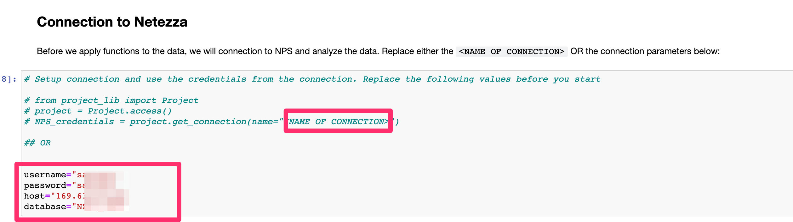

### 6. Loading or Unloading data from external source

> NOTE: Before loading or unloading the data, upload `orders.tbl` from the cloned repository folder by going to `doc/source/data`. In the project home page, on the `Assets` tab, click the data icon, and browse to upload the file. You will have to unzip the data locally first before you upload.

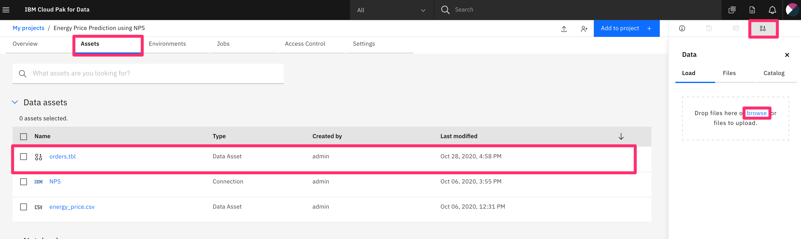

`nzpy` also supports streaming data loads and unloads. There are quite a few variations we can do here. You can load data from local files to NPS which uses streaming transient external table with `REMOTESOURCE 'ODBC'` option as shown below:

```python
with con.cursor() as cursor:
    cursor.execute('''
        insert into nzpy_test..ORDERS
            select * from external '/project_data/data_asset/orders.tbl'
                using (
                    delim '|' 
                    remotesource 'odbc'
                    skiprows 1)''')
    print(f"{cursor.rowcount} rows inserted")

```

The same also works in reverse to unload data from NPS to local files.

```python
with con.cursor() as cursor:
    cursor.execute('''
      create external table '/tmp/orders.tbl'
        using (
            delim '|' 
            remotesource 'odbc'
            includeheader yes
        ) as select * from nzpy_test..orders limit 20''')    
pd.read_csv('/tmp/orders.csv', delimiter='|')

```

### 7. Load data from other data sources

Data sources, like external servers, github etc. can be used by streaming data from the source through the python data pipeline. The python code is using nzpy which read data from external sources and connect that directly to `nzpy` pipe via a named pipe.

>Note: The named pipe method below works seamlessly on Linux and Mac. For windows win32pipe module can be used to achieve the same

Creating a pipe for all data streaming loads lets one have a thread that can push data to this pipe. The other end is connected to Netezza via an external table.

```python
import pathlib
datapipe = pathlib.Path("/tmp/datapipe")

def create_datapipe():
    global datapipe
    if datapipe.exists():
        print(f"Cleaning prior {datapipe}")
        datapipe.unlink()
    
    print(f"Initializing fifo", end='..')
    os.mkfifo(datapipe)
    print('Done')

import requests, shutil, subprocess, gzip

def load_published_dataset(ds):
    with open(datapipe, "wb") as pipe:
        with requests.get(ds, stream=True) as r:
            with gzip.GzipFile(fileobj=r.raw) as unzip:
                shutil.copyfileobj(unzip, pipe)
```

Now we can use both of the above functins to load external sources and create table in NPS.

```python
import threading

create_datapipe()
if datapipe.exists() and datapipe.is_fifo():
    print("Pipe ready")

source = 'https://raw.githubusercontent.com/ibm-watson-data-lab/open-data/master/cars/cars.csv'
streamer = threading.Thread(target=load_published_dataset, args=(source,))
streamer.start()

with con.cursor() as cursor:                            
    cursor.execute(f''' 
        insert into nzpy_test..cars select * from external '{datapipe}' 
            using (
                delim ','
                remotesource 'odbc'
                skiprows 1
            )''')
    print(f"{cursor.rowcount} rows inserted")
    
streamer.join()
```

### 8. Load data from Object Store

NPS can load and unload data from object stores like Amazon S3 and IBM Cloud object store. This works by using Netezza External Tables to read from and write to object store.

We will look into how to load and unload using AWS S3.

To load into Netezza from s3 we can use `external table` with AWS S3 credentials like below:

```python
cursor=con.cursor()
table = 'covid'
with con.cursor() as cur:
    # drop any old table
    r = cur.execute(f"select 1 from _v_table where tablename = '{table}'")
    if r.fetchall():
        cur.execute(f'drop table {table}')
        
    # create a table to load data
    cur.execute(f'create table {table} ({schema})')
    print(f"Table {table} created")
    
    # load data from object store
    cur.execute(f'''
    insert into {table} 
        select * from external 'owid-covid-data.csv' ({schema})
        using (
            remotesource 'S3' 
            delim ','
            uniqueid 'covid' 
            accesskeyid '{os.environ["AWS_ACCESS_KEY_ID"]}'
            secretaccesskey '{os.environ["AWS_SECRET_ACCESS_KEY"]}'
            defaultregion '{os.environ["AWS_REGION"]}'
            bucketurl '{os.environ["BUCKET"]}'
            skiprows 1
        )''')
    print(f"{cur.rowcount} Rows loaded")
```

Once thats done we can analyze the data and visualize by selecting data from NPS.
Lets analyze on week over week trend on covid cases.

```python
# Get a week over week trend
df = pd.read_sql_query('''
    select continent,
            this_week(covid_date) as wk,
            max(new_cases) as total 
    from covid 
    where 
        continent is not null and
        continent != ''
    group by wk, continent
    order by wk, continent
    ''', con,
    parse_dates = {b'WK': '%Y-%m-%d'})
df.columns = [c.decode().lower() for c in df.columns]
df.total = df.total.astype(float)
df.head()
```

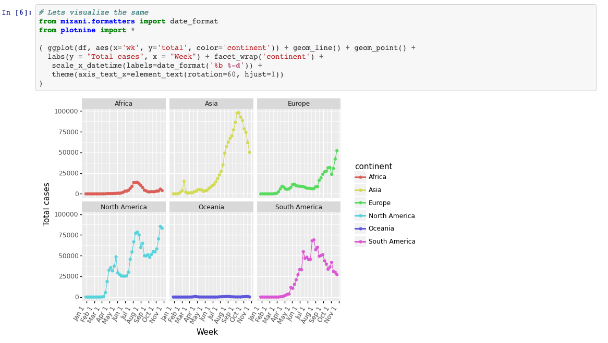


### 9. Loading and analyzing Australian weather station data

In this section, we will use Python and Netezza Performance Server, to load and analyze the data on `Australian temperatures and rainfall` published publically.

We will be doing following with the data:
    * Load data into Netezza
    * Filtering, transformation and analytics in database
    * Visualizing

* Lets create two tables `temperature` created from `temperatures.csv` dataset and `rainfall` created from `rainfall.csv` dataset.

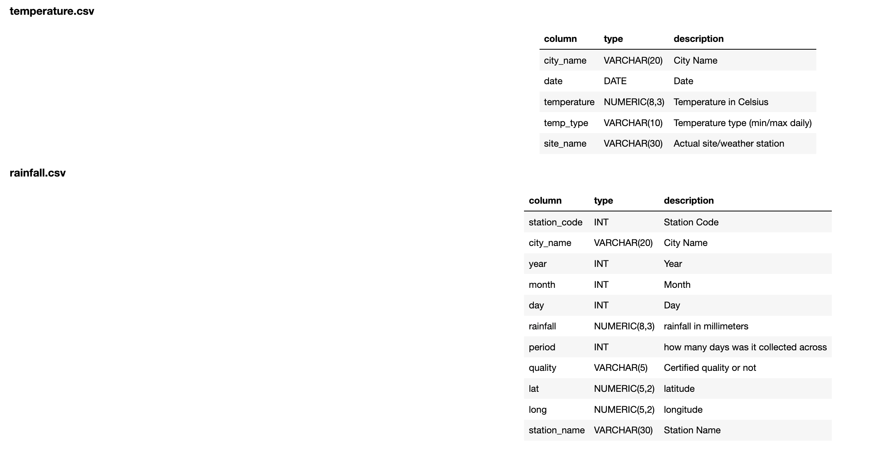

* The code below that you see in the cell will create two tables for us.

```python
with con.cursor() as cursor:
    # find which of the tables already exist
    existing = { table[0] for table in cursor.execute("select lower(tablename) from _v_table where lower(tablename) in ('rainfall', 'temperature')").fetchall() }
    if 'temperature' not in existing:
        # create only if they don't
        cursor.execute('''
        create table temperature (
            city_name     VARCHAR(20),
            date          DATE,
            temperature   NUMERIC(8,3),
            temp_type     VARCHAR(10),
            site_name     VARCHAR(30)
        ) distribute on (city_name)
        ''')
        print("Table temperature created")
        
    if 'rainfall' not in existing:
        cursor.execute('''
        create table rainfall (
            station_code  INT,
            city_name     VARCHAR(20),
            year          INT,
            month         INT,
            day           INT,
            rainfall      NUMERIC(8,3),
            period        INT,
            quality       VARCHAR(5),
            lat           NUMERIC(5,2),
            long          NUMERIC(5,2),
            station_name  VARCHAR(100)
        ) distribute on (city_name, station_code)
        ''')
        print("Table rainfall created")
```

The following python code along with `nzpy` library will create a datapipe to load the temperature and rainfall data.

```python
# load temperature rainfall data
create_datapipe()
rainfall = "https://raw.githubusercontent.com/rfordatascience/tidytuesday/master/data/2020/2020-01-07/rainfall.csv"
loader = threading.Thread(target=load_published_dataset, args=(rainfall,))
loader.start()

with con.cursor() as cursor:
    print("Loading data", end=".. ")
    result = cursor.execute(f'''INSERT INTO rainfall SELECT * FROM EXTERNAL '{datapipe}'
                                USING (
                                    DELIMITER ','
                                    REMOTESOURCE 'odbc'
                                    NULLVALUE 'NA'
                                    SKIPROWS 1)''')
    print(f"{cursor.rowcount} rows inserted")
    
loader.join()

# load temperature data

create_datapipe()
temperature = "https://raw.githubusercontent.com/rfordatascience/tidytuesday/master/data/2020/2020-01-07/temperature.csv"

loader = threading.Thread(target=load_published_dataset, args=(temperature,))
loader.start()

with con.cursor() as cursor:
    print("Loading data", end=".. ")
    result = cursor.execute(f'''INSERT INTO temperature SELECT * FROM EXTERNAL '{datapipe}'
                                USING (
                                    DELIMITER ','
                                    REMOTESOURCE 'odbc'
                                    NULLVALUE 'NA'
                                    SKIPROWS 1)''')
    print(f"{cursor.rowcount} rows inserted")
    
loader.join()

```


* lets analyze the data that we just loaded to NPS databse tables by grouping the temperatures across months and decades to reduce the dataset. After that visualization and further analytics can be done easily in python.

```python
df = pd.read_sql('''
    select extract(decade from date) * 10 as decade,
           extract(month from date) as month,
           city_name,
           avg(temperature) as avg
        from temperature
        where city_name in ('SYDNEY', 'MELBOURNE')
        group by month, decade, city_name
        order by month
 ''', con)

df.columns = [c.decode().lower() for c in df.columns]
df.decade = df.decade.astype(int)
df.avg = df.avg.astype(float)
df.month = df.month.astype(int)
df
```
 The output of the above query is shown below:

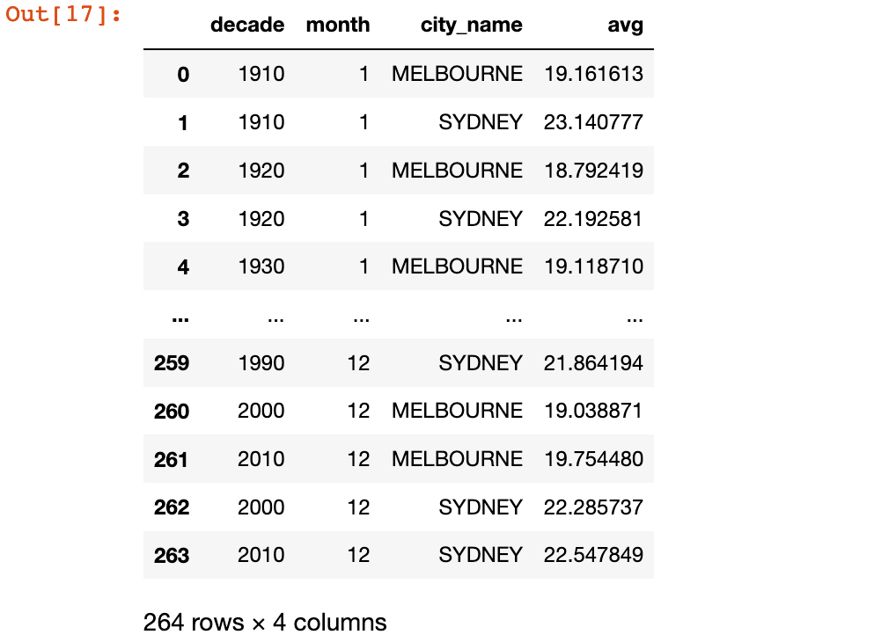

* Now we can combine DataFrame with ggplot too see how average temperatures for two cities across the year stack up across all decades for the last 100 years.

```python
import matplotlib, calendar
from plotnine import *
%matplotlib inline

( ggplot(df, aes(x='month', y='avg', group='decade', color='decade')) + geom_line() + geom_point() + 
  labs(y = "Average Temperature (°C)", x = "Month") + facet_wrap('city_name') +
   scale_color_gradient(low="blue", high="red") + 
   scale_x_discrete(labels=list(calendar.month_abbr[1:]), limits=range(12)) + 
   theme(axis_text_x=element_text(rotation=60, hjust=1))
)
```

The output of the above plotting is shown below:

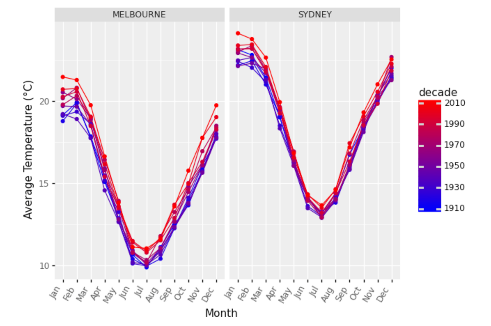


## Next Steps

At the end of this, you are now familiar with Netezza datbase and how you can use `nzpy` library to connect to the database, load and retireve data, analyze and visualize the data.

In the next notebook, we will deep dive into NPS In-Database analytics functions and create machine learning models to predict. For this we will be using energy dataset.

Click [here](README-analytics.md) to explore on In-Database analtyics using Netezza.
